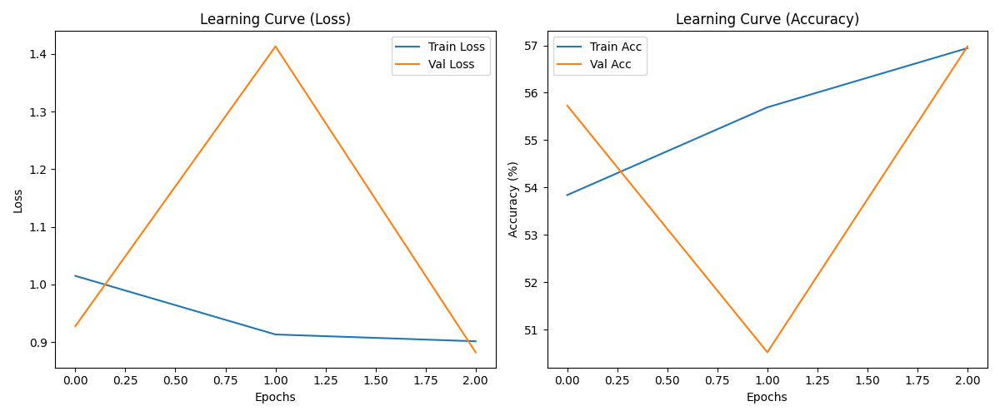

# ADPM3D: Alzheimer's Disease Prediction with 3D & 2D MRI Analysis

**Batch ID:** Batch-5  
**Course:** Undergrad Major Project 2026  
**Institution:** PACE Institute of Technology and Sciences

---

## 👥 Team Members
| Name | Roll Number | GitHub Handle |
| :--- | :--- | :--- |
| T. Priyanka Reddy | 22KQ1A6128 | @T-Priyanka-Reddy |
| B. Hepsiba Rani | 22KQ1A6104 | @B-Hepsiba-Rani |
| G. Mukesh Anand | 23KQ5A6101 | @G-Mukesh-Anand |
| S. Chandra Sekhar | 22KQ1A6155 | @S-Chandra-Sekhar |
| N. Raja | 22KQ1A6153 | @N-Raja |

---

## 🚀 Project Overview
**Problem Statement:** Alzheimer's Disease (AD) is a progressive neurodegenerative disorder that is often diagnosed late. This project leverages AI to analyze 3D MRI volumes and 2D slice sequences to provide an automated, early detection system for classifying Normal Cognition (CN) versus Disease (AD/MCI).

**Key Objective:** To achieve high accuracy (>95% target) in identifying Alzheimer's and Mild Cognitive Impairment using a hybrid 3D CNN and 2D sequence-based deep learning architecture optimized for limited CPU/GPU resources.

---

## 📊 Dataset Information
* **Source:** [ADNI via LONI](https://ida.loni.usc.edu/login.jsp) & [Kaggle Alzheimer Dataset](https://www.kaggle.com/datasets/nataliateixeira/imagens-alzheimer-treino-val-teste)
* **Description:** 
  * **3D Dataset:** 1,019 NIfTI files generated from 152,432 original DICOM slices (22 unique subjects).
  * **2D Dataset:** Multi-class slice data for NonDemented, VeryMildDemented, MildDemented, and ModerateDemented classification.
* **Preprocessing:** 
  * **3D:** DICOM to NIfTI conversion (hyper-granular), resampling to 64x64x64 or 80x80x80, Z-score normalization, and random 3D rotations for augmentation.
  * **2D:** CLAHE (Contrast Limited Adaptive Histogram Equalization) and ROI cropping for enhanced features.

> **⚠️ Note:** Dataset is excluded from this repo due to size. Access the processed data [HERE - Google Drive](https://drive.google.com/drive/folders/1hhdaOP83lqRjZ0VO_imLOJXO5lJNHlfs?usp=sharing).

---

## 🧠 Model Architecture & Methodology
We implemented a dual-stream approach:
* **3D Pipeline:** FastHCCT (Lightweight 3D CNN) and Advanced3DCNN with 4 Convolutional layers and global average pooling, optimized for volumetric feature extraction.
* **2D Pipeline:** Optimized CNN architecture utilizing CLAHE-preprocessed 2D slices for multi-class impairment detection.
* **Framework:** PyTorch
* **Algorithm:** 3D CNN / Hybrid CNN-Transformer

---

## 📈 Results & Performance
Our current best models show promising results, with path to improvement via dataset expansion.

### 3D Model Performance (CN vs Disease)
| Metric | Value |
| :--- | :--- |
| Best Validation Accuracy | 77.63% |
| Test Accuracy | 74.68% |
| Training Loss (Final) | 0.5546 |

### 2D Model Performance (Multi-Class)
| Metric | Value |
| :--- | :--- |
| Overall Accuracy | 0.58 |
| Weighted F1-Score | 0.54 |

 
*(Note: Visual representation of the training accuracy and loss over epochs)*

---

## 🛠️ Installation & Usage
### 1. Requirements
Ensure you have Python 3.10+ installed. Install all necessary libraries:
```bash
pip install -r requirements.txt
```

### 2. Running Training & Testing
To train the 3D models:
```bash
python train_3D.py
```

To run the full 2D classification pipeline:
```bash
python run_2D.py
```

To run final 2D testing:
```bash
python test_2D.py
```

To run final 3D testing:
```bash
python test_3D.py
```

### 3. Source Links
* **Repository:** [GitHub](https://github.com/PACE-ITS/major-project-batch-5)
* **3D Dataset Source:** [LONI IDA](https://ida.loni.usc.edu/login.jsp)
* **2D Image Dataset:** [Kaggle](https://www.kaggle.com/datasets/nataliateixeira/imagens-alzheimer-treino-val-teste)
